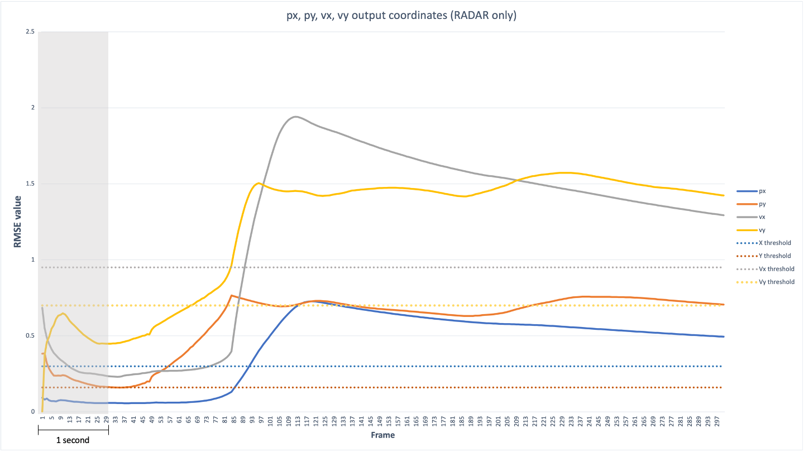

# Sensor Fusion Unscented Kalman Filter Highway Project

This project is the final project in [Udacity](https://www.udacity.com)'s [sensor fusion nanodegree](https://www.udacity.com/course/sensor-fusion-engineer-nanodegree--nd313). This project implements an Unscented Kalman Filter to estimate the state of multiple cars on a highway using noisy lidar and radar measurements. The project obtains RMSE values that are lower than the tolerance outlined in the project specification below. 

# Highway Demo

### Before
The following animated GIF demonstrates the highway simulation before implementing the unscented kalman filter. The RMSE error values can be seen in red, showing that they exceed their respective threshold values. 


### After
The following animated GIF demonstrates the highway simulation after implementing the unscented kalman filter. There are no RMSE error values, showing that they do not exceed their respective threshold values.


The above GIF is just an extract of a few seconds. [This MP4 file](results/UKF_SensorFusion_RMSE.mp4) demonstrates the full-length execution of the program.


# Accuracy
The `px`, `py`, `vx`, `vy` output coordinates must have an RMSE <= [0.30, 0.16, 0.95, 0.70] after running for longer than 1 second.

The simulation collects the position and velocity values that the UKF algorithm outputs and they are compare to the ground truth data. My `px`, `py`, `vx`, and `vy` RMSE should be less than or equal to the values [0.30, 0.16, 0.95, 0.70] after the simulator has ran for longer than 1 second. The simulator will also display an error message if the RMSE values surpass the threshold.

I added a simple private funciton in [highway.h](src/ukf/highway.h) to write the RMSE results to [a CSV file](results/ukf_performance_results.csv) to allow a detailed performance analysis:

```c++
    void WriteToFile(VectorXd rmse_data)
    {
        const string filename = "../../results/ukf_performance_results.csv";
        const string separator = ", ";
        ofstream results_file;
        results_file.open(filename, ios_base::app);
        results_file << rmse_data[0] << separator << rmse_data[1] << separator << rmse_data[2] << separator << rmse_data[3] << endl;
    }
```

I then imported the CSV data into [a spreadsheet](results/ukf_performance_results.xlsx) and used that to create the graphs used in this analysis.

The following graph shows the output coordinate **before implementing the UKF functions**. In this case, the values are clearly way above the RMSE threshold values.


The following graph shows **the effect of implementing the UKF functions**: the output coordinate stay well below the RMSE values after 1 second.


And here are the two graphs again, for side-by-side comparison:

Before implementing UFK functions | With UKF functions
:---:|:---:
 | 

## Comparing results when only one sensor is used
As expected, Sensor fusion gives better results than using only one sensor type. For comparison, the following two graphs show the results when only using radar or only using lidar.

There are two flags in [ukf.cpp](src/ukf/ukf.cpp) that can be toggled to enable or disable the sensors:

```c++
    // LiDAR measurements will be ignored if this is false
    use_laser_ = true;

    // RADAR measurements will be ignored if this is false
    use_radar_ = true;
```

#### Comparing results when only using Radar



By the time 3 seconds have passed, all of the RMSE values have exceeded their thresholds.  

#### Comparing results when only using Lidar


Lidar alone performs much better than Radar alone. `Vx` is consistently above it's RMSE threshold. All of the other RMSE values are below their respective threshold values. However, the performance of Lidar alone is still not as good as both sensors together. 

# Building and running the project
The main program can be built and ran by doing the following from the project top directory.

1. mkdir build
2. cd build
3. cmake ..
4. make
5. ./ukf_highway


The code in `main.cpp` is using `highway.h` to create a straight 3 lane highway environment with 3 traffic cars and the main ego car at the center.

The viewer scene is centered around the ego car and the coordinate system is relative to the ego car as well. The ego car is green while the 
other traffic cars are blue. The traffic cars will be accelerating and altering their steering to change lanes. Each of the traffic cars has
it's own UKF object generated for it, and will update each individual one during every time step. 

The red spheres above cars represent the (x,y) lidar detection and the purple lines show the radar measurements with the velocity magnitude along the detected angle. The Z axis is not taken into account for tracking, so you are only tracking along the X/Y axis.


## Dependencies
* cmake >= 3.17
  * All OSes: [click here for installation instructions](https://cmake.org/install/)
* make >= 4.1 (Linux, Mac), 3.81 (Windows)
  * Linux: make is installed by default on most Linux distros
  * Mac: [install Xcode command line tools to get make](https://developer.apple.com/xcode/features/)
  * Windows: [Click here for installation instructions](http://gnuwin32.sourceforge.net/packages/make.htm)
* gcc/g++ >= 5.4
  * Linux: gcc / g++ is installed by default on most Linux distros
  * Mac: same deal as make - [install Xcode command line tools](https://developer.apple.com/xcode/features/)
  * Windows: recommend using [MinGW](http://www.mingw.org/)
* [PCL](https://pointclouds.org) 1.3
* [Eigen3](https://eigen.tuxfamily.org/index.php) 3.3

## Basic Build Instructions

1. Clone this repo.
2. Make a build directory: `mkdir build && cd build`
3. Compile: `cmake .. && make`
4. Run it: `./ukf_highway`

## Code Style

This project uses [Google's C++ style guide](https://google.github.io/styleguide/cppguide.html).

## Generating Additional Data

If you'd like to generate your own radar and lidar modify the code in `highway.h` to alter the cars. Also check out `tools.cpp` to
change how measurements are taken, for instance lidar markers could be the (x,y) center of bounding boxes by scanning the PCD environment
and performing clustering. This is similar to what was done in Sensor Fusion Lidar Obstacle Detection.

# References

* Wikipedia. [_Kalman filter_](https://en.wikipedia.org/wiki/Kalman_filter)
* James Teow, 2018. [_Understanding Kalman Filters with Python_](https://medium.com/@jaems33/understanding-kalman-filters-with-python-2310e87b8f48)
* Anjum, M.L., Park, J., Hwang, W., Kwon, H.I., Kim, J.H., Lee, C. and Kim, K.S., 2010, October. [_Sensor data fusion using unscented kalman filter for accurate localization of mobile robots_](https://ieeexplore.ieee.org/abstract/document/5669779). In ICCAS 2010 (pp. 947-952). IEEE.
* Wan, E.A. and Van Der Merwe, R., 2000, October. [_The unscented Kalman filter for nonlinear estimation_](https://www.seas.harvard.edu/courses/cs281/papers/unscented.pdf). In Proceedings of the IEEE 2000 Adaptive Systems for Signal Processing, Communications, and Control Symposium (Cat. No. 00EX373) (pp. 153-158). IEEE.